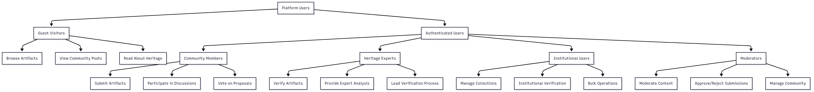
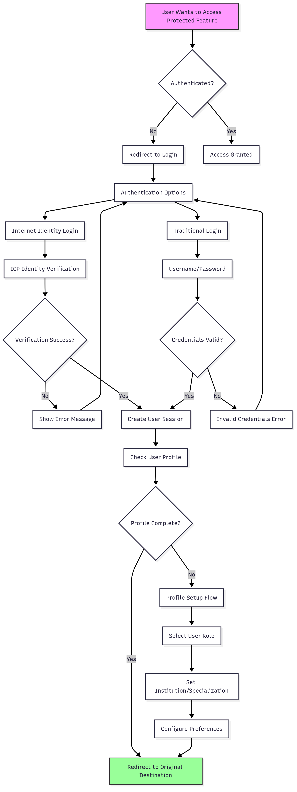
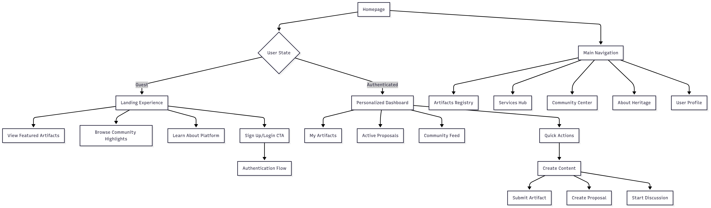
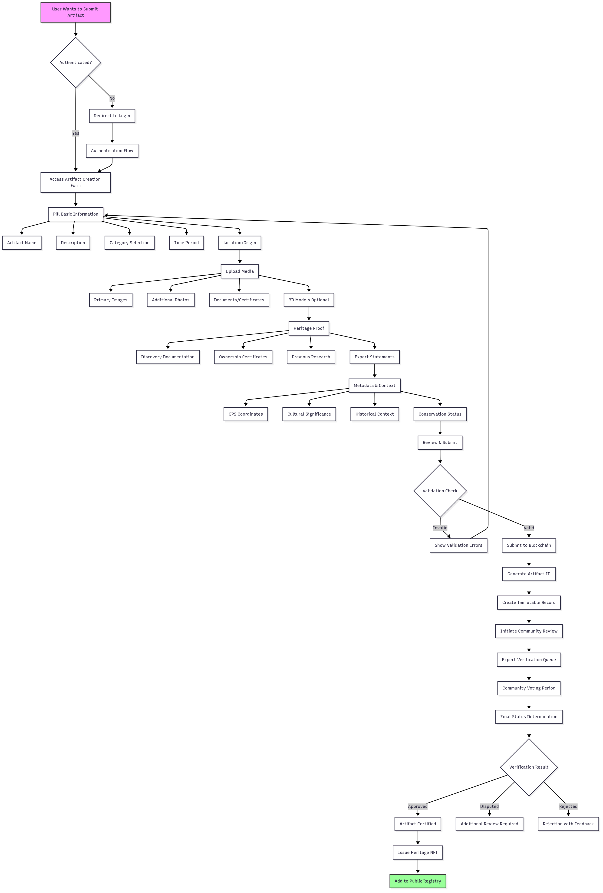
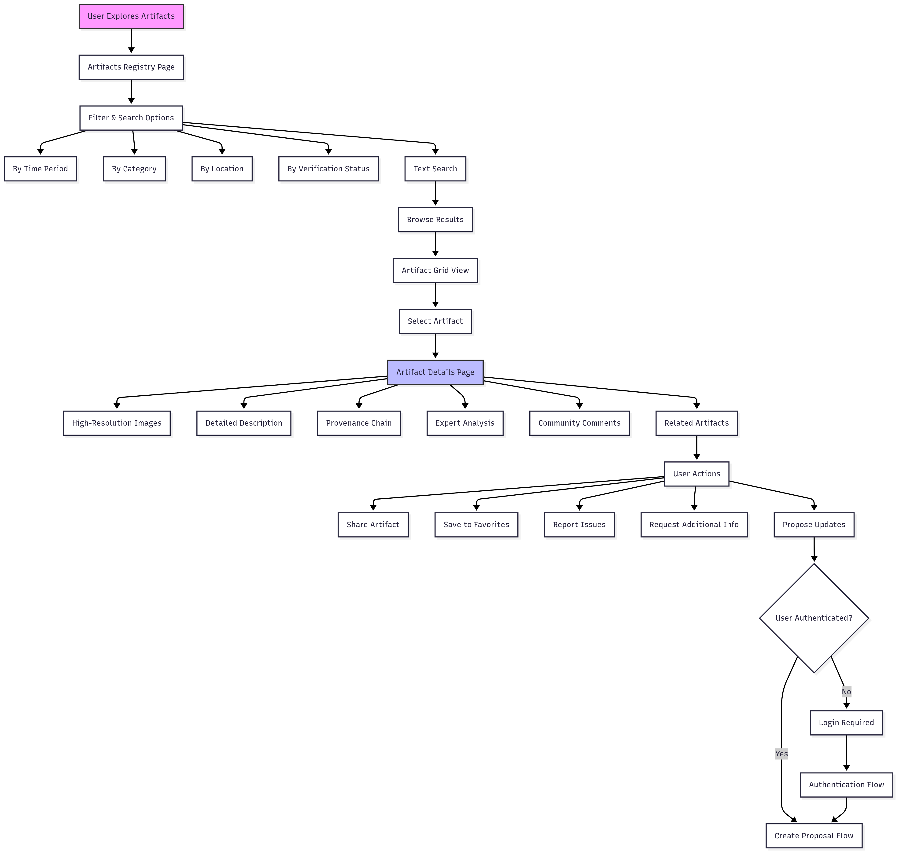
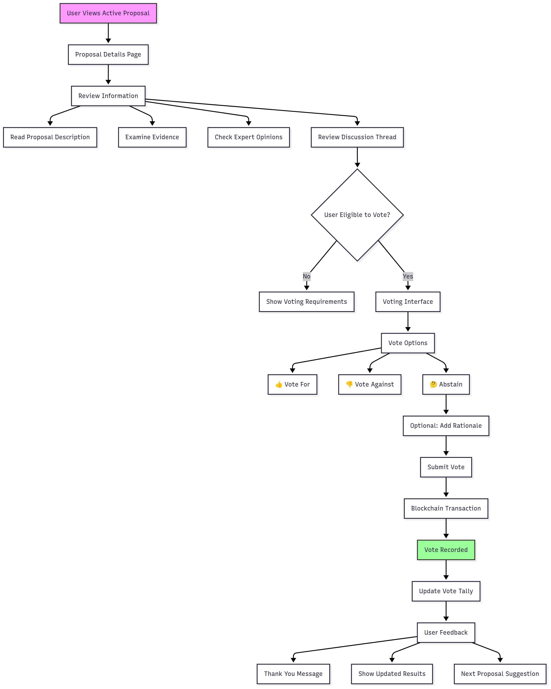
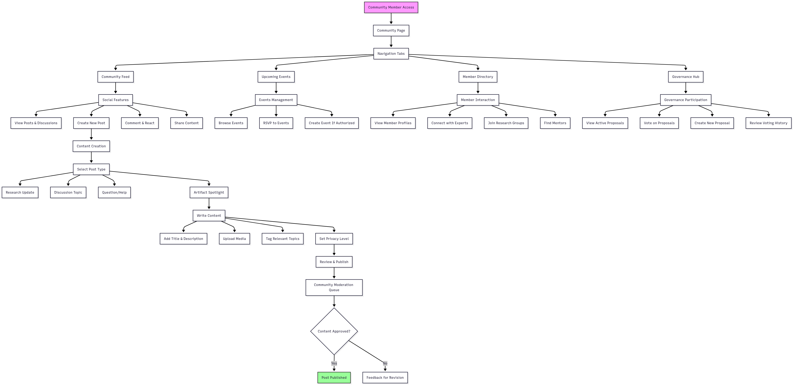
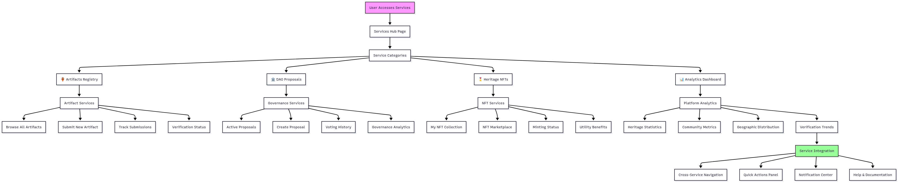
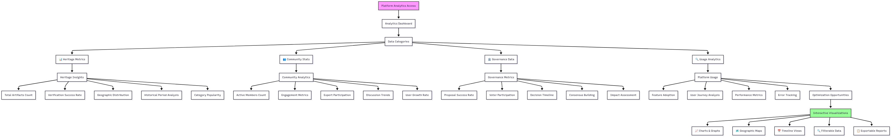

# 🏺 Asl (أصل) - Digital Heritage Preservation Platform

<div align="center">


**"Preserving Egypt's Legacy Through Blockchain Innovation"**

[](https://opensource.org/licenses/MIT)
[](https://internetcomputer.org/)
[](https://www.rust-lang.org/)
[](https://reactjs.org/)
[](https://vitejs.dev/)

🌐 **[Live Demo on IC Mainnet](https://maptp-dyaaa-aaaac-a364a-cai.icp0.io/)** 🌐
📱 **[Try Our App Now](https://github.com/zeyadlotfy11/Asl-project/releases/download/v1.0.0/app-release.apk)** 📱

</div>

## 📖 Introduction

**Asl (أصل)** is a cutting-edge decentralized platform built on the Internet Computer Protocol (ICP) for preserving Egyptian cultural heritage. The platform combines blockchain immutability with modern web technologies to create tamper-proof records of artifacts, fostering global collaboration between institutions, researchers, and heritage enthusiasts.

### 🎯 Vision & Mission

- **Combat artifact looting** through transparent, immutable documentation
- **Preserve cultural identity** using decentralized blockchain technology
- **Enable global collaboration** between museums, researchers, and institutions
- **Create lasting digital heritage** for future generations

### 🏆 Key Achievements

- ✅ **Full-stack decentralized application** on Internet Computer
- ✅ **Successfully deployed on IC Mainnet** - Live at [maptp-dyaaa-aaaac-a364a-cai.icp0.io](https://maptp-dyaaa-aaaac-a364a-cai.icp0.io/)
- ✅ **Community-driven governance** with DAO features
- ✅ **Bilingual support** (Arabic/English) with RTL layout
- ✅ **Advanced artifact management** with AI analysis integration
- ✅ **Real-time collaboration** features and community engagement
- ✅ **Mobile-responsive design** with Egyptian-themed UI/UX

## 🏗️ Architecture

### 🔧 Technology Stack

#### **Frontend**

- **React 18** with TypeScript for type-safe development
- **Vite** for fast development and optimized builds
- **Tailwind CSS** for utility-first styling and responsive design
- **Framer Motion** for smooth animations and transitions
- **React Router** for client-side routing
- **React Hot Toast** for elegant notifications
- **Lucide React** for consistent iconography

#### **Backend**

- **Rust** with IC CDK for high-performance canister development
- **IC Stable Structures** for persistent data storage
- **Candid** for type-safe inter-canister communication
- **IC CDK Timers** for scheduled operations
- **Serde** for serialization/deserialization

#### **Blockchain & Infrastructure**

- **Internet Computer Protocol (ICP)** for decentralized hosting
- **Stable Storage** for data persistence across canister upgrades
- **Canister Smart Contracts** for business logic
- **Internet Identity** integration (planned)

### 🏛️ System Architecture

```
┌─────────────────────────────────────────────────────────┐
│                    Frontend (React/TS) Canister         │
│  ┌─────────────┐ ┌─────────────┐ ┌─────────────────┐    │
│  │   Pages     │ │ Components  │ │    Contexts     │    │
│  │             │ │             │ │                 │    │
│  │ • Home      │ │ • Layout    │ │ • Language      │    │
│  │ • Community │ │ • Artifact  │ │ • Theme         │    │
│  │ • Artifacts │ │ • Community │ │ • Auth          │    │
│  │ • Profile   │ │ • Forms     │ │                 │    │
│  └─────────────┘ └─────────────┘ └─────────────────┘    │
└─────────────────────────────────────────────────────────┘
                              │
                    ┌─────────┴─────────┐
                       Candid interface
                    └─────────┬─────────┘
                              │
┌─────────────────────────────────────────────────────────┐
│                  Backend (Rust Canister)                │
│  ┌─────────────┐ ┌─────────────┐ ┌─────────────────┐    │
│  │   Modules   │ │   Storage   │ │    Services     │    │
│  │             │ │             │ │                 │    │
│  │ • Artifacts │ │ • StableBT  │ │ • Validation    │    │
│  │ • Community │ │ • Memory    │ │ • Authentication│    │
│  │ • DAO       │ │ • Log       │ │ • Governance    │    │
│  │ • Users     │ │             │ │ • Analytics     │    │
│  └─────────────┘ └─────────────┘ └─────────────────┘    │
└─────────────────────────────────────────────────────────┘
```

### 🗂️ Project Structure

```
asl/
├── 📁 src/
│   ├── 📁 asl_backend/          # Rust canister
│   │   ├── 📄 lib.rs           # Main canister logic
│   │   ├── 📁 modules/         # Feature modules
│   │   │   ├── 📄 artifacts.rs # Artifact management
│   │   │   ├── 📄 community.rs # Community features
│   │   │   ├── 📄 users.rs     # User management
│   │   │   └── 📄 governance.rs# DAO governance
│   │   └── 📄 Cargo.toml
│   └── 📁 asl_frontend/         # React application
│       ├── 📁 src/
│       │   ├── 📁 components/   # Reusable UI components
│       │   │   ├── 📁 layout/   # Layout components
│       │   │   ├── 📁 common/   # Shared components
│       │   │   └── 📁 home/     # Home-specific components
│       │   ├── 📁 contexts/     # React contexts
│       │   ├── 📁 pages/        # Route components
│       │   ├── 📁 services/     # API services
│       │   ├── 📁 hooks/        # Custom React hooks
│       │   └── 📁 utils/        # Utility functions
│       ├── 📄 package.json
│       ├── 📄 vite.config.js
│       ├── 📄 tailwind.config.js
│       └── 📄 tsconfig.json
├── 📁 declarations/             # Generated Candid bindings
├── 📄 dfx.json                 # DFINITY configuration
└── 📄 Cargo.toml               # Workspace configuration
```

### 🎨 Design System & UI/UX

#### **Egyptian-Themed Design**

- **Golden Pharaoh Palette**: Amber, gold, and orange gradients
- **Hieroglyphic Elements**: Authentic Egyptian symbols and patterns
- **Ankh Symbol Integration**: Life key of pharaohs as back-to-top button
- **Responsive Animations**: Smooth transitions and pharaoh-inspired effects

#### **Accessibility & Internationalization**

- **RTL Support**: Complete right-to-left layout for Arabic
- **Bilingual Interface**: Seamless English/Arabic switching
- **Dark/Light Themes**: System preference detection
- **Responsive Design**: Mobile-first approach with progressive enhancement

## 🚀 Quick Start

### Prerequisites

Ensure you have the following installed:

- **Node.js** (v18 or higher) - [Download](https://nodejs.org/)
- **DFX SDK** (v0.15.0 or higher) - [Install Guide](https://sdk.dfinity.org/docs/quickstart/local-quickstart.html)
- **Rust** (latest stable) - [Install](https://rustup.rs/)
- **Git** - [Download](https://git-scm.com/)

### 🔧 Installation

1. **Clone the repository**

```bash
git clone https://github.com/your-username/asl-heritage-platform.git
cd asl-heritage-platform
```

2. **Install dependencies**

```bash
# Install frontend dependencies
cd src/asl_frontend
npm install
cd ../..

# Install additional IC development tools
npm run candid:install    # For Candid type generation
npm run ic-wasm:install   # For WebAssembly optimization
```

3. **Start local Internet Computer replica**

```bash
dfx start --background
```

4. **Deploy canisters**

```bash
dfx deploy
```

5. **Generate type declarations**

```bash
dfx generate asl_backend
```

6. **Start development server**

```bash
cd src/asl_frontend
npm start
```

The application will be available at `http://localhost:3000`

### 🐳 One-Command Setup

For convenience, use our setup script:

```bash
# Make setup script executable
chmod +x scripts/setup-dev.sh

# Run complete setup
./scripts/setup-dev.sh
```

## 🎥 Demo Videos

### 📺 **Demo Video**

[](https://youtu.be/C5KdRCh_Sek)

Watch our comprehensive demo showcasing the full functionality of the ASL platform, including artifact management, community features, and blockchain integration.

**🔗 [Watch Demo Video](https://youtu.be/C5KdRCh_Sek)**

### 🎤 **Pitch Video**

[](https://youtu.be/5isksxXc1RQ)

Learn about our vision, mission, and the innovative approach we're taking to preserve Egyptian cultural heritage through blockchain technology.

**🔗 [Watch Pitch Video](https://youtu.be/5isksxXc1RQ)**

## 🧪 Testing

ASL features robust testing infrastructure ensuring platform reliability and security. Our comprehensive test suite covers backend logic, frontend components, integration workflows, and user interactions to maintain high code quality standards.

ASL includes comprehensive test suites for both backend and frontend components. See [TESTING.md](TESTING.md) for detailed testing documentation.

### **Backend Tests (Rust)**

```bash
cd src/asl_backend

# Run all tests
cargo test

# Run with output
cargo test -- --nocapture

# Run specific test module
cargo test integration_tests
cargo test unit_tests
```

### **Frontend Tests (React/TypeScript)**

```bash
cd src/asl_frontend

# Install test dependencies
npm install

# Run all tests
npm test

# Run tests with coverage
npm run test:coverage

# Run tests with UI
npm run test:ui
```

### **Test Coverage**

- ✅ **Backend**: User management, artifact operations, DAO governance, AI analysis
- ✅ **Frontend**: Component testing, service layer, contexts, utilities, E2E workflows
- ✅ **Integration**: Full application workflows and canister interactions
- ✅ **Accessibility**: ARIA compliance, keyboard navigation, RTL support
- ✅ **Performance**: Load testing, memory optimization, bundle analysis

## 📚 Documentation

### 🔥 Core Features

#### **1. Artifact Management**

- **Digital Cataloging**: Complete artifact documentation with metadata
- **Immutable Records**: Blockchain-based tamper-proof storage
- **Media Upload**: Support for images, documents, and 3D models
- **GPS Tracking**: Location-based artifact mapping
- **Provenance Chain**: Complete ownership and discovery history

#### **2. Community Platform**

- **Discussion Forums**: Threaded conversations about artifacts
- **Expert Verification**: Community-driven authenticity validation
- **Event Management**: Heritage events and exhibition coordination
- **Member Profiles**: Researcher and institution showcases
- **Collaboration Tools**: Real-time project coordination

#### **3. DAO Governance**

- **Proposal System**: Community-driven platform decisions
- **Voting Mechanisms**: Democratic governance processes
- **Expert Validation**: Qualified reviewer systems
- **Reputation System**: Merit-based community standing
- **Treasury Management**: Decentralized fund allocation

#### **4. Advanced Analytics**

- **Artifact Statistics**: Platform-wide heritage metrics
- **Community Insights**: User engagement analytics
- **Geographic Mapping**: Artifact origin visualization
- **Trend Analysis**: Heritage preservation patterns
- **Impact Reporting**: Platform effectiveness metrics

#### **5. Integration Capabilities**

- **Museum APIs**: Institutional collection integration
- **Government Systems**: Ministry of Antiquities connectivity
- **Research Platforms**: Academic database linking
- **International Standards**: UNESCO/CIDOC-CRM compliance
- **Export Functionality**: Data portability and backup

### 🛡️ Security & Privacy

- **Decentralized Storage**: Data distributed across ICP network
- **Cryptographic Verification**: Artifact authenticity proofs
- **Access Control**: Role-based permission systems
- **Audit Trails**: Complete action logging and tracking
- **Data Sovereignty**: User-controlled information management

### 🌊 User Flow Diagrams

The ASL platform features comprehensive user flow diagrams that illustrate key user journeys and interaction patterns across all platform features. These visual flows demonstrate how different user types navigate the sophisticated heritage preservation ecosystem.

#### **🔄 Main Platform Flow**



#### **🔐 Authentication Flow**



#### **🧭 Navigation Flow**



#### **🏺 Artifact Management Flow**



#### **👁️ Artifact Viewing Flow**



#### **🗳️ Voting & Governance Flow**



#### **👥 Community Interaction Flow**



#### **⚙️ Services Hub Flow**



#### **📊 Analytics & Insights Flow**



These user flow diagrams showcase the platform's intuitive design and comprehensive feature set, demonstrating how blockchain technology seamlessly integrates with user-friendly interfaces to create an exceptional heritage preservation experience.

## 🏛️ ICP Features Used

### **Core ICP Capabilities**

- ✅ **Canister Smart Contracts** - Core business logic implementation
- ✅ **Stable Memory Storage** - Persistent data across upgrades
- ✅ **Inter-Canister Communication** - Modular architecture
- ✅ **Web-Speed Performance** - Sub-second response times
- ✅ **Candid Interface** - Type-safe API definitions

### **Advanced Features** (Planned)

- 🔄 **Internet Identity Integration** - Secure authentication
- 🔄 **HTTP Outcalls** - External API integration
- 🔄 **Cycles Management** - Automated canister funding
- 🔄 **Timer Functions** - Scheduled operations
- 🔄 **Cross-Chain Integration** - Multi-blockchain support

## 🎯 Mainnet Deployment

### **Canister IDs**

| Service      | Network | Canister ID                   | Status    |
| ------------ | ------- | ----------------------------- | --------- |
| ASL Backend  | Local   | `rdmx6-jaaaa-aaaaa-aaadq-cai` | 🟢 Active |
| ASL Frontend | Local   | `rrkah-fqaaa-aaaaa-aaaaq-cai` | 🟢 Active |
| ASL Backend  | Mainnet | `maptp-dyaaa-aaaac-a364a-cai` | � Active  |
| ASL Frontend | Mainnet | `maptp-dyaaa-aaaac-a364a-cai` | � Active  |

### **Deployment Commands**

```bash
# Deploy to local replica
dfx deploy --network local

# Deploy to IC mainnet (requires cycles)
dfx deploy --network ic

# Upgrade existing canister
dfx canister install --mode upgrade asl_backend
```

## 🚧 Challenges Faced

### **Technical Challenges**

1. **Stable Storage Management**

   - Challenge: Complex data structures in stable memory
   - Solution: Custom serialization with ic-stable-structures

2. **Frontend-Backend Integration**

   - Challenge: Type-safe communication with Candid
   - Solution: Automated type generation and validation

3. **Multilingual RTL Support**

   - Challenge: Complex layout switching for Arabic
   - Solution: Context-based styling with Tailwind CSS

4. **Performance Optimization**
   - Challenge: Large artifact images and metadata
   - Solution: Lazy loading and optimized asset delivery

### **Design Challenges**

1. **Cultural Authenticity**

   - Challenge: Respectful representation of Egyptian heritage
   - Solution: Extensive research and cultural consultation

2. **User Experience Complexity**
   - Challenge: Balancing feature richness with simplicity
   - Solution: Progressive disclosure and intuitive navigation

## 🌟 Future Roadmap

### **Phase 1: Foundation** ✅

- ✅ Core artifact management
- ✅ Community platform
- ✅ Bilingual interface
- ✅ Egyptian-themed design

### **Phase 2: Enhancement** 🔄

- 🔄 Internet Identity integration
- 🔄 Advanced search and filtering
- 🔄 Mobile application
- 🔄 API documentation portal

### **Phase 3: Expansion** 📋

- 📋 NFT heritage certificates
- 📋 AI-powered artifact analysis
- 📋 Museum partnership program
- 📋 Government integration APIs

### **Phase 4: Scale** 🔮

- 🔮 Multi-country heritage support
- 🔮 Virtual reality integration
- 🔮 Blockchain interoperability
- 🔮 Global heritage alliance

## 🎯 Key Features & Use Cases

### For Museums & Institutions

- **Digital Cataloging**: Upload complete collections with immutable certificates
- **Provenance Tracking**: Detailed history and ownership chains
- **Legal Documentation**: NFT-based proof for artifact return cases

### For Archaeologists & Researchers

- **Field Documentation**: Log discoveries with timestamped GPS NFTs
- **Collaborative Verification**: Community-driven authenticity confirmation
- **Academic Access**: Open APIs for research and analysis

### For Government & Law Enforcement

- **Ministry Integration**: Official artifact status updates
- **International Cooperation**: Secure data sharing with Interpol/UNESCO
- **Legal Evidence**: Blockchain-backed proof for court proceedings

### For Heritage Enthusiasts

- **Cultural Exploration**: Browse verified Egyptian artifacts
- **Community Participation**: Vote on artifact authenticity through DAO
- **Educational Content**: Learn about Egypt's rich cultural heritage

## 🏺 Platform Capabilities

| Feature                    | ASL Platform             | Traditional Systems         |
| -------------------------- | ------------------------ | --------------------------- |
| **Fully Decentralized**    | ✅ On-chain storage      | ❌ Centralized servers      |
| **Immutable Proof**        | ✅ Blockchain verified   | ❌ Editable databases       |
| **Community Verification** | ✅ DAO governance        | ❌ Single authority         |
| **Low-Cost Hosting**       | ✅ ICP efficiency        | ❌ Expensive infrastructure |
| **NFT Integration**        | ✅ Heritage certificates | ❌ No digital proof         |
| **Global Access**          | ✅ Open APIs             | ❌ Limited access           |

## 🌟 Real-World Impact

- **Legal Reclamation**: Strengthens Egypt's case to reclaim smuggled artifacts
- **Forgery Prevention**: Reduces risk of fake claims and counterfeit pieces
- **Community Ownership**: Creates shared responsibility for national heritage
- **Digital Preservation**: Safeguards cultural data for future generations
- **Educational Value**: Promotes awareness of Egyptian archaeological treasures

## 🤝 Contributing

We welcome contributions from the global heritage preservation community!

### **How to Contribute**

1. **Fork the repository**
2. **Create a feature branch** (`git checkout -b feature/amazing-feature`)
3. **Commit your changes** (`git commit -m 'Add amazing feature'`)
4. **Push to the branch** (`git push origin feature/amazing-feature`)
5. **Open a Pull Request**

### **Contribution Guidelines**

- Follow TypeScript and Rust best practices
- Include comprehensive tests for new features
- Update documentation for API changes
- Respect cultural sensitivity in heritage-related content
- Ensure bilingual support for user-facing features

### **Development Standards**

- **Code Style**: Prettier for TypeScript, rustfmt for Rust
- **Commit Messages**: Conventional commits format
- **Documentation**: JSDoc for TypeScript, rustdoc for Rust
- **Testing**: 80%+ test coverage requirement
- **Security**: Security-first development practices

## 📄 License

This project is licensed under the MIT License - see the [LICENSE](LICENSE) file for details.

## 🔗 Resources & Links

### **Technology Resources**

- [Internet Computer (ICP)](https://internetcomputer.org/) - Blockchain platform
- [DFINITY SDK](https://sdk.dfinity.org/) - Development tools
- [Candid](https://github.com/dfinity/candid) - Interface description language
- [IC Stable Structures](https://github.com/dfinity/stable-structures) - Storage library
- [Rust Programming](https://www.rust-lang.org/) - Rust Official Documentation
- [React Documentation](https://reactjs.org/) - React Framework
- [Vite](https://vitejs.dev/) - Build Tool

## 📱 Mobile Application (Flutter)

### **Professional Flutter App Architecture**

ASL features a cutting-edge **Flutter mobile application** that brings the complete heritage preservation experience to iOS and Android devices. Built with modern Flutter architecture patterns, the mobile app provides seamless access to all platform features while maintaining the Egyptian-themed design and professional user experience.

#### **🏗️ Flutter Architecture Stack**

- **Flutter SDK**: Latest stable version with Material 3 design system
- **State Management**: Flutter Riverpod with code generation and async providers
- **Backend Integration**: agent_dart for complete Internet Computer connectivity
- **Navigation**: GoRouter with authentication guards and nested routing
- **Storage**: Hive for local caching and offline functionality
- **Networking**: Dio HTTP client with interceptors and error handling
- **Code Generation**: Freezed for immutable models and JSON serialization
- **UI/UX**: Custom ASL theme with responsive design and animations

#### **📁 Flutter Project Structure**

```
asl_flutter/
├── 📁 lib/
│   ├── 📁 core/                    # Core infrastructure
│   │   ├── 📁 config/              # App configuration
│   │   ├── 📁 theme/               # ASL theme and styling
│   │   ├── 📁 routing/             # Navigation configuration
│   │   └── 📁 services/            # Core services
│   │       ├── 📄 network_service.dart
│   │       ├── 📄 icp_service.dart
│   │       └── 📄 storage_service.dart
│   ├── 📁 shared/                  # Shared components
│   │   ├── 📁 models/              # Data models with Freezed
│   │   │   ├── 📄 artifact.dart
│   │   │   ├── 📄 user.dart
│   │   │   ├── 📄 proposal.dart
│   │   │   └── 📄 nft.dart
│   │   ├── 📁 providers/           # Riverpod state providers
│   │   │   ├── 📄 auth_provider.dart
│   │   │   ├── 📄 artifact_provider.dart
│   │   │   └── 📄 proposal_provider.dart
│   │   └── 📁 widgets/             # Reusable components
│   │       ├── 📄 custom_app_bar.dart
│   │       ├── 📄 dashboard_card.dart
│   │       └── 📄 loading_overlay.dart
│   ├── 📁 features/                # Feature-based organization
│   │   ├── 📁 auth/               # Authentication
│   │   │   └── 📁 presentation/
│   │   │       └── 📁 pages/
│   │   │           ├── 📄 splash_page.dart
│   │   │           ├── 📄 onboarding_page.dart
│   │   │           └── 📄 login_page.dart
│   │   ├── 📁 home/               # Dashboard
│   │   ├── 📁 artifacts/          # Artifact management
│   │   ├── 📁 proposals/          # Voting system
│   │   ├── 📁 nfts/              # NFT marketplace
│   │   ├── 📁 profile/           # User profile
│   │   └── 📁 settings/          # App settings
│   └── 📄 main.dart               # App entry point
├── 📁 android/                    # Android configuration
├── 📁 ios/                        # iOS configuration
├── 📄 pubspec.yaml               # Dependencies
└── 📄 analysis_options.yaml      # Code analysis rules
```

#### **🚀 Flutter Key Features**

##### **1. Authentication System**
- **Internet Identity Integration**: Secure Web3 authentication
- **Biometric Authentication**: Fingerprint and face recognition support
- **Splash & Onboarding**: Professional app introduction flow
- **Session Management**: Automatic token refresh and secure storage

##### **2. Professional UI/UX**
- **Egyptian Theme**: Authentic pharaoh-inspired design with golden palette
- **Material 3 Design**: Modern Google design system implementation
- **Responsive Layouts**: Adaptive UI for all screen sizes and orientations
- **Smooth Animations**: Professional transitions and loading states
- **Dark/Light Theme**: System preference detection and manual switching

##### **3. Artifact Management**
- **Visual Gallery**: Grid and list views with high-quality image rendering
- **Search & Filter**: Advanced filtering with real-time search capabilities
- **Detail Views**: Comprehensive artifact information with media galleries
- **Submission Flow**: Multi-step artifact upload with validation
- **Offline Access**: Cached content for offline browsing

##### **4. Community Features**
- **Proposal Voting**: Interactive voting interface with progress tracking
- **Discussion Forums**: Threaded conversations with real-time updates
- **User Profiles**: Member showcases with activity history
- **Notifications**: Push notifications for important updates
- **Social Sharing**: Native sharing capabilities for artifacts and discoveries

##### **5. NFT Marketplace**
- **Visual Marketplace**: Grid layout for NFT browsing and discovery
- **Purchase Flow**: Secure transaction processing with ICP integration
- **Collection Management**: Personal NFT collection with detailed views
- **Price Tracking**: Market analytics and price history charts
- **Wishlist**: Save favorite NFTs for future purchase

##### **6. Advanced Features**
- **GPS Integration**: Location-based artifact mapping and discovery
- **Camera Integration**: Direct photo upload with EXIF data preservation
- **Analytics Dashboard**: Personal statistics and community insights
- **Multi-language Support**: Arabic/English with RTL layout support
- **Accessibility**: Full accessibility compliance with screen reader support

#### **🔧 Flutter Setup & Development**

##### **Prerequisites**
```bash
# Install Flutter SDK (latest stable)
flutter --version  # Ensure Flutter 3.16.0+

# Install development dependencies
flutter doctor      # Verify installation
flutter pub get     # Install packages
```

##### **Quick Start**
```bash
# Navigate to Flutter app directory
cd asl_flutter

# Install dependencies
flutter pub get

# Generate code (models, providers)
flutter packages pub run build_runner build

# Run on emulator/device
flutter run

# Run with specific flavor
flutter run --flavor development
```

##### **Build Commands**
```bash
# Development build
flutter run --debug

# Release build for testing
flutter build apk --release

# iOS release build
flutter build ios --release

# Generate app bundle
flutter build appbundle
```

#### **📦 Flutter Dependencies**

##### **Core Dependencies**
- `flutter_riverpod`: State management with code generation
- `go_router`: Declarative routing with type safety
- `freezed`: Immutable models and union types
- `json_annotation`: JSON serialization support
- `dio`: HTTP client with interceptors
- `hive_flutter`: Local storage and caching

##### **UI/UX Dependencies**
- `google_fonts`: Typography with Egyptian-themed fonts
- `lottie`: Smooth animations and loading indicators
- `cached_network_image`: Optimized image loading and caching
- `flutter_staggered_grid_view`: Advanced grid layouts
- `smooth_page_indicator`: Professional onboarding indicators

##### **Platform Integration**
- `agent_dart`: Internet Computer Protocol integration
- `local_auth`: Biometric authentication support
- `connectivity_plus`: Network status monitoring
- `share_plus`: Native sharing capabilities
- `image_picker`: Camera and gallery integration

##### **Development Tools**
- `build_runner`: Code generation runner
- `riverpod_generator`: Provider code generation
- `json_serializable`: JSON mapping generation
- `flutter_launcher_icons`: App icon generation
- `flutter_native_splash`: Splash screen customization

#### **🎯 Flutter Roadmap**

##### **Phase 1: Foundation** ✅
- ✅ Professional app architecture with feature-based structure
- ✅ Complete ICP backend integration with agent_dart
- ✅ Authentication system with Internet Identity support
- ✅ Egyptian-themed UI with Material 3 design
- ✅ Navigation system with bottom navigation and routing

##### **Phase 2: Core Features** 🔄
- 🔄 Artifact management with advanced search and filtering
- 🔄 Proposal voting system with real-time updates
- 🔄 NFT marketplace with purchase flow
- 🔄 User profile management and statistics
- 🔄 Push notifications and real-time messaging

##### **Phase 3: Advanced Features** 📋
- 📋 Camera integration for artifact photography
- 📋 GPS mapping for artifact locations
- 📋 Offline synchronization with conflict resolution
- 📋 Social features and community interaction
- 📋 Analytics dashboard with data visualization

##### **Phase 4: Enterprise Features** 🔮
- 🔮 Multi-tenant support for institutions
- 🔮 Advanced security with hardware security modules
- 🔮 White-label solutions for museums
- 🔮 API integration with external heritage systems
- 🔮 AR/VR artifact visualization

#### **📱 Mobile App Benefits**

- **Native Performance**: Smooth 60fps animations and interactions
- **Offline Capability**: Access cached content without internet
- **Push Notifications**: Real-time updates for important events
- **Camera Integration**: Direct artifact photography and upload
- **Biometric Security**: Secure authentication with fingerprint/face
- **Location Services**: GPS-based artifact discovery and mapping
- **Cross-Platform**: Single codebase for iOS and Android
- **Professional UX**: Enterprise-grade user experience design

#### **🔐 Security & Privacy**

- **Secure Storage**: Encrypted local storage for sensitive data
- **Certificate Pinning**: Protection against man-in-the-middle attacks
- **Biometric Authentication**: Hardware-backed security features
- **Session Management**: Automatic logout and token rotation
- **Privacy Controls**: Granular permission management
- **Audit Logging**: Complete action tracking for compliance

---

<div align="center">

**ASL (أصل) - Preserving Egypt's Legacy Through Blockchain Innovation** 🏛️✨

_"Every artifact tells a story of a civilization that spanned thousands of years"_

**Built with ❤️ by the ASL Team**

📱 **Now Available on Mobile** - Professional Flutter app for iOS & Android

[Demo Video](https://youtu.be/C5KdRCh_Sek) • [Pitch Video](https://youtu.be/5isksxXc1RQ) • [Mobile App Repository](./asl_flutter/)

</div>
