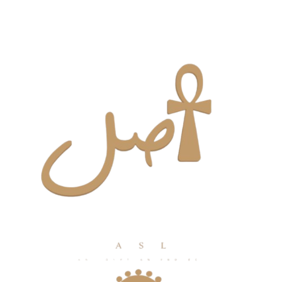

# 🏺 Asl (أصل) - Digital Heritage Preservation Platform

<div align="center">



**"Preserving Egypt's Legacy Through Blockchain Innovation"**

[](https://opensource.org/licenses/MIT)
[](https://internetcomputer.org/)
[](https://www.rust-lang.org/)
[](https://reactjs.org/)
[](https://vitejs.dev/)

</div>

## 📖 Introduction

**Asl (أصل)** is a cutting-edge decentralized platform built on the Internet Computer Protocol (ICP) for preserving Egyptian cultural heritage. The platform combines blockchain immutability with modern web technologies to create tamper-proof records of artifacts, fostering global collaboration between institutions, researchers, and heritage enthusiasts.

### 🎯 Vision & Mission

- **Combat artifact looting** through transparent, immutable documentation
- **Preserve cultural identity** using decentralized blockchain technology
- **Enable global collaboration** between museums, researchers, and institutions
- **Create lasting digital heritage** for future generations

### 🏆 Key Achievements

- ✅ **Full-stack decentralized application** on Internet Computer
- ✅ **Community-driven governance** with DAO features
- ✅ **Bilingual support** (Arabic/English) with RTL layout
- ✅ **Advanced artifact management** with AI analysis integration
- ✅ **Real-time collaboration** features and community engagement
- ✅ **Mobile-responsive design** with Egyptian-themed UI/UX

## 🏗️ Architecture

### 🔧 Technology Stack

#### **Frontend**

- **React 18** with TypeScript for type-safe development
- **Vite** for fast development and optimized builds
- **Tailwind CSS** for utility-first styling and responsive design
- **Framer Motion** for smooth animations and transitions
- **React Router** for client-side routing
- **React Hot Toast** for elegant notifications
- **Lucide React** for consistent iconography

#### **Backend**

- **Rust** with IC CDK for high-performance canister development
- **IC Stable Structures** for persistent data storage
- **Candid** for type-safe inter-canister communication
- **IC CDK Timers** for scheduled operations
- **Serde** for serialization/deserialization

#### **Blockchain & Infrastructure**

- **Internet Computer Protocol (ICP)** for decentralized hosting
- **Stable Storage** for data persistence across canister upgrades
- **Canister Smart Contracts** for business logic
- **Internet Identity** integration (planned)

### 🏛️ System Architecture

```
┌─────────────────────────────────────────────────────────┐
│                    Frontend (React/TS) Canister         │
│  ┌─────────────┐ ┌─────────────┐ ┌─────────────────┐    │
│  │   Pages     │ │ Components  │ │    Contexts     │    │
│  │             │ │             │ │                 │    │
│  │ • Home      │ │ • Layout    │ │ • Language      │    │
│  │ • Community │ │ • Artifact  │ │ • Theme         │    │
│  │ • Artifacts │ │ • Community │ │ • Auth          │    │
│  │ • Profile   │ │ • Forms     │ │                 │    │
│  └─────────────┘ └─────────────┘ └─────────────────┘    │
└─────────────────────────────────────────────────────────┘
                              │
                    ┌─────────┴─────────┐
                       ICP Network ♾️
                    └─────────┬─────────┘
                              │
┌─────────────────────────────────────────────────────────┐
│                  Backend (Rust Canister)                │
│  ┌─────────────┐ ┌─────────────┐ ┌─────────────────┐    │
│  │   Modules   │ │   Storage   │ │    Services     │    │
│  │             │ │             │ │                 │    │
│  │ • Artifacts │ │ • StableBT  │ │ • Validation    │    │
│  │ • Community │ │ • Memory    │ │ • Authentication│    │
│  │ • DAO       │ │ • Log       │ │ • Governance    │    │
│  │ • Users     │ │             │ │ • Analytics     │    │
│  └─────────────┘ └─────────────┘ └─────────────────┘    │
└─────────────────────────────────────────────────────────┘
```

### 🗂️ Project Structure

```
asl/
├── 📁 src/
│   ├── 📁 asl_backend/          # Rust canister
│   │   ├── 📄 lib.rs           # Main canister logic
│   │   ├── 📁 modules/         # Feature modules
│   │   │   ├── 📄 artifacts.rs # Artifact management
│   │   │   ├── 📄 community.rs # Community features
│   │   │   ├── 📄 users.rs     # User management
│   │   │   └── 📄 governance.rs# DAO governance
│   │   └── 📄 Cargo.toml
│   └── 📁 asl_frontend/         # React application
│       ├── 📁 src/
│       │   ├── 📁 components/   # Reusable UI components
│       │   │   ├── 📁 layout/   # Layout components
│       │   │   ├── 📁 common/   # Shared components
│       │   │   └── 📁 home/     # Home-specific components
│       │   ├── 📁 contexts/     # React contexts
│       │   ├── 📁 pages/        # Route components
│       │   ├── 📁 services/     # API services
│       │   ├── 📁 hooks/        # Custom React hooks
│       │   └── 📁 utils/        # Utility functions
│       ├── 📄 package.json
│       ├── 📄 vite.config.js
│       ├── 📄 tailwind.config.js
│       └── 📄 tsconfig.json
├── 📁 declarations/             # Generated Candid bindings
├── 📄 dfx.json                 # DFINITY configuration
└── 📄 Cargo.toml               # Workspace configuration
```

### 🎨 Design System & UI/UX

#### **Egyptian-Themed Design**

- **Golden Pharaoh Palette**: Amber, gold, and orange gradients
- **Hieroglyphic Elements**: Authentic Egyptian symbols and patterns
- **Ankh Symbol Integration**: Life key of pharaohs as back-to-top button
- **Responsive Animations**: Smooth transitions and pharaoh-inspired effects

#### **Accessibility & Internationalization**

- **RTL Support**: Complete right-to-left layout for Arabic
- **Bilingual Interface**: Seamless English/Arabic switching
- **Dark/Light Themes**: System preference detection
- **Responsive Design**: Mobile-first approach with progressive enhancement

## 🚀 Quick Start

### Prerequisites

Ensure you have the following installed:

- **Node.js** (v18 or higher) - [Download](https://nodejs.org/)
- **DFX SDK** (v0.15.0 or higher) - [Install Guide](https://sdk.dfinity.org/docs/quickstart/local-quickstart.html)
- **Rust** (latest stable) - [Install](https://rustup.rs/)
- **Git** - [Download](https://git-scm.com/)

### 🔧 Installation

1. **Clone the repository**

```bash
git clone https://github.com/your-username/asl-heritage-platform.git
cd asl-heritage-platform
```

2. **Install dependencies**

```bash
# Install frontend dependencies
cd src/asl_frontend
npm install
cd ../..

# Install additional IC development tools
npm run candid:install    # For Candid type generation
npm run ic-wasm:install   # For WebAssembly optimization
```

3. **Start local Internet Computer replica**

```bash
dfx start --background
```

4. **Deploy canisters**

```bash
dfx deploy
```

5. **Generate type declarations**

```bash
dfx generate asl_backend
```

6. **Start development server**

```bash
cd src/asl_frontend
npm start
```

The application will be available at `http://localhost:3000`

### 🐳 One-Command Setup

For convenience, use our setup script:

```bash
# Make setup script executable
chmod +x scripts/setup-dev.sh

# Run complete setup
./scripts/setup-dev.sh
```

## 📚 Documentation

### 🔥 Core Features

#### **1. Artifact Management**

- **Digital Cataloging**: Complete artifact documentation with metadata
- **Immutable Records**: Blockchain-based tamper-proof storage
- **Media Upload**: Support for images, documents, and 3D models
- **GPS Tracking**: Location-based artifact mapping
- **Provenance Chain**: Complete ownership and discovery history

#### **2. Community Platform**

- **Discussion Forums**: Threaded conversations about artifacts
- **Expert Verification**: Community-driven authenticity validation
- **Event Management**: Heritage events and exhibition coordination
- **Member Profiles**: Researcher and institution showcases
- **Collaboration Tools**: Real-time project coordination

#### **3. DAO Governance**

- **Proposal System**: Community-driven platform decisions
- **Voting Mechanisms**: Democratic governance processes
- **Expert Validation**: Qualified reviewer systems
- **Reputation System**: Merit-based community standing
- **Treasury Management**: Decentralized fund allocation

#### **4. Advanced Analytics**

- **Artifact Statistics**: Platform-wide heritage metrics
- **Community Insights**: User engagement analytics
- **Geographic Mapping**: Artifact origin visualization
- **Trend Analysis**: Heritage preservation patterns
- **Impact Reporting**: Platform effectiveness metrics

#### **5. Integration Capabilities**

- **Museum APIs**: Institutional collection integration
- **Government Systems**: Ministry of Antiquities connectivity
- **Research Platforms**: Academic database linking
- **International Standards**: UNESCO/CIDOC-CRM compliance
- **Export Functionality**: Data portability and backup

### 🛡️ Security & Privacy

- **Decentralized Storage**: Data distributed across ICP network
- **Cryptographic Verification**: Artifact authenticity proofs
- **Access Control**: Role-based permission systems
- **Audit Trails**: Complete action logging and tracking
- **Data Sovereignty**: User-controlled information management

## 🏛️ ICP Features Used

### **Core ICP Capabilities**

- ✅ **Canister Smart Contracts** - Core business logic implementation
- ✅ **Stable Memory Storage** - Persistent data across upgrades
- ✅ **Inter-Canister Communication** - Modular architecture
- ✅ **Web-Speed Performance** - Sub-second response times
- ✅ **Candid Interface** - Type-safe API definitions

### **Advanced Features** (Planned)

- 🔄 **Internet Identity Integration** - Secure authentication
- 🔄 **HTTP Outcalls** - External API integration
- 🔄 **Cycles Management** - Automated canister funding
- 🔄 **Timer Functions** - Scheduled operations
- 🔄 **Cross-Chain Integration** - Multi-blockchain support

## 🎯 Mainnet Deployment

### **Canister IDs**

| Service      | Network | Canister ID                   | Status     |
| ------------ | ------- | ----------------------------- | ---------- |
| ASL Backend  | Local   | `rdmx6-jaaaa-aaaaa-aaadq-cai` | 🟢 Active  |
| ASL Frontend | Local   | `rrkah-fqaaa-aaaaa-aaaaq-cai` | 🟢 Active  |
| ASL Backend  | Mainnet | `TBD`                         | 🔄 Pending |
| ASL Frontend | Mainnet | `TBD`                         | 🔄 Pending |

### **Deployment Commands**

```bash
# Deploy to local replica
dfx deploy --network local

# Deploy to IC mainnet (requires cycles)
dfx deploy --network ic

# Upgrade existing canister
dfx canister install --mode upgrade asl_backend
```

## 🚧 Challenges Faced

### **Technical Challenges**

1. **Stable Storage Management**

   - Challenge: Complex data structures in stable memory
   - Solution: Custom serialization with ic-stable-structures

2. **Frontend-Backend Integration**

   - Challenge: Type-safe communication with Candid
   - Solution: Automated type generation and validation

3. **Multilingual RTL Support**

   - Challenge: Complex layout switching for Arabic
   - Solution: Context-based styling with Tailwind CSS

4. **Performance Optimization**
   - Challenge: Large artifact images and metadata
   - Solution: Lazy loading and optimized asset delivery

### **Design Challenges**

1. **Cultural Authenticity**

   - Challenge: Respectful representation of Egyptian heritage
   - Solution: Extensive research and cultural consultation

2. **User Experience Complexity**
   - Challenge: Balancing feature richness with simplicity
   - Solution: Progressive disclosure and intuitive navigation

## 🌟 Future Roadmap

### **Phase 1: Foundation** ✅

- ✅ Core artifact management
- ✅ Community platform
- ✅ Bilingual interface
- ✅ Egyptian-themed design

### **Phase 2: Enhancement** 🔄

- 🔄 Internet Identity integration
- 🔄 Advanced search and filtering
- 🔄 Mobile application
- 🔄 API documentation portal

### **Phase 3: Expansion** 📋

- 📋 NFT heritage certificates
- 📋 AI-powered artifact analysis
- 📋 Museum partnership program
- 📋 Government integration APIs

### **Phase 4: Scale** 🔮

- 🔮 Multi-country heritage support
- 🔮 Virtual reality integration
- 🔮 Blockchain interoperability
- 🔮 Global heritage alliance

## 🎯 Key Features & Use Cases

### For Museums & Institutions

- **Digital Cataloging**: Upload complete collections with immutable certificates
- **Provenance Tracking**: Detailed history and ownership chains
- **Legal Documentation**: NFT-based proof for artifact return cases

### For Archaeologists & Researchers

- **Field Documentation**: Log discoveries with timestamped GPS NFTs
- **Collaborative Verification**: Community-driven authenticity confirmation
- **Academic Access**: Open APIs for research and analysis

### For Government & Law Enforcement

- **Ministry Integration**: Official artifact status updates
- **International Cooperation**: Secure data sharing with Interpol/UNESCO
- **Legal Evidence**: Blockchain-backed proof for court proceedings

### For Heritage Enthusiasts

- **Cultural Exploration**: Browse verified Egyptian artifacts
- **Community Participation**: Vote on artifact authenticity through DAO
- **Educational Content**: Learn about Egypt's rich cultural heritage

## 🏺 Platform Capabilities

| Feature                    | ASL Platform             | Traditional Systems         |
| -------------------------- | ------------------------ | --------------------------- |
| **Fully Decentralized**    | ✅ On-chain storage      | ❌ Centralized servers      |
| **Immutable Proof**        | ✅ Blockchain verified   | ❌ Editable databases       |
| **Community Verification** | ✅ DAO governance        | ❌ Single authority         |
| **Low-Cost Hosting**       | ✅ ICP efficiency        | ❌ Expensive infrastructure |
| **NFT Integration**        | ✅ Heritage certificates | ❌ No digital proof         |
| **Global Access**          | ✅ Open APIs             | ❌ Limited access           |

## 🌟 Real-World Impact

- **Legal Reclamation**: Strengthens Egypt's case to reclaim smuggled artifacts
- **Forgery Prevention**: Reduces risk of fake claims and counterfeit pieces
- **Community Ownership**: Creates shared responsibility for national heritage
- **Digital Preservation**: Safeguards cultural data for future generations
- **Educational Value**: Promotes awareness of Egyptian archaeological treasures

## 🤝 Contributing

We welcome contributions from the global heritage preservation community!

### **How to Contribute**

1. **Fork the repository**
2. **Create a feature branch** (`git checkout -b feature/amazing-feature`)
3. **Commit your changes** (`git commit -m 'Add amazing feature'`)
4. **Push to the branch** (`git push origin feature/amazing-feature`)
5. **Open a Pull Request**

### **Contribution Guidelines**

- Follow TypeScript and Rust best practices
- Include comprehensive tests for new features
- Update documentation for API changes
- Respect cultural sensitivity in heritage-related content
- Ensure bilingual support for user-facing features

### **Development Standards**

- **Code Style**: Prettier for TypeScript, rustfmt for Rust
- **Commit Messages**: Conventional commits format
- **Documentation**: JSDoc for TypeScript, rustdoc for Rust
- **Testing**: 80%+ test coverage requirement
- **Security**: Security-first development practices

## 📄 License

This project is licensed under the MIT License - see the [LICENSE](LICENSE) file for details.

## 🔗 Resources & Links

### **Technology Resources**

- [Internet Computer (ICP)](https://internetcomputer.org/) - Blockchain platform
- [DFINITY SDK](https://sdk.dfinity.org/) - Development tools
- [Candid](https://github.com/dfinity/candid) - Interface description language
- [IC Stable Structures](https://github.com/dfinity/stable-structures) - Storage library
- [Rust Programming](https://www.rust-lang.org/) - Rust Official Documentation
- [React Documentation](https://reactjs.org/) - React Framework
- [Vite](https://vitejs.dev/) - Build Tool

---

<div align="center">

**ASL (أصل) - Preserving Egypt's Legacy Through Blockchain Innovation** 🏛️✨

_"Every artifact tells a story of a civilization that spanned thousands of years"_

**Built with ❤️ by the ASL Team**

[Demo Video](https://youtu.be/67XkRfEOP5A?si=4m0D986m9M7OECUb)

</div>
